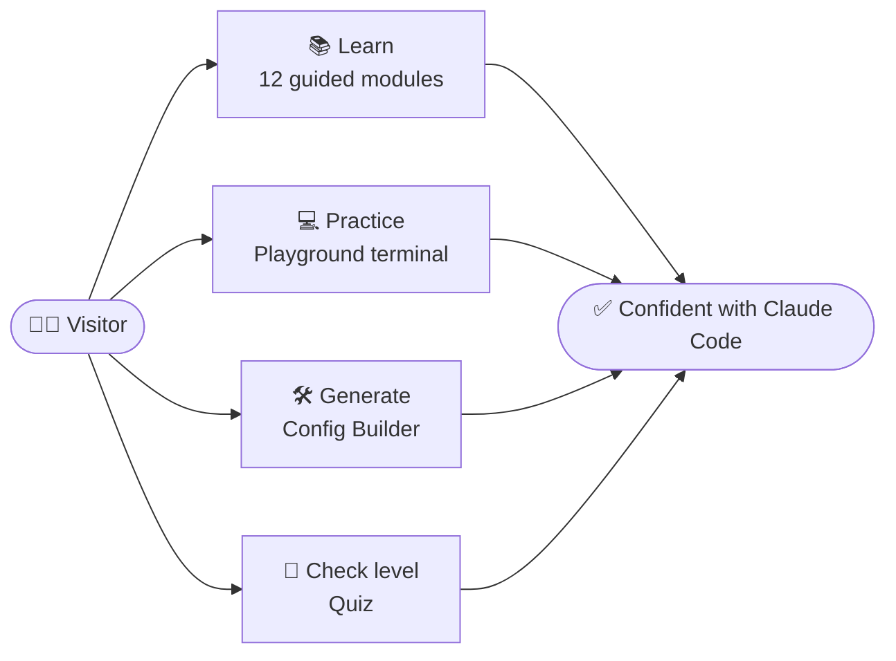
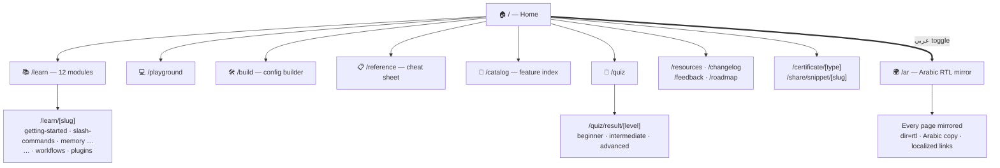
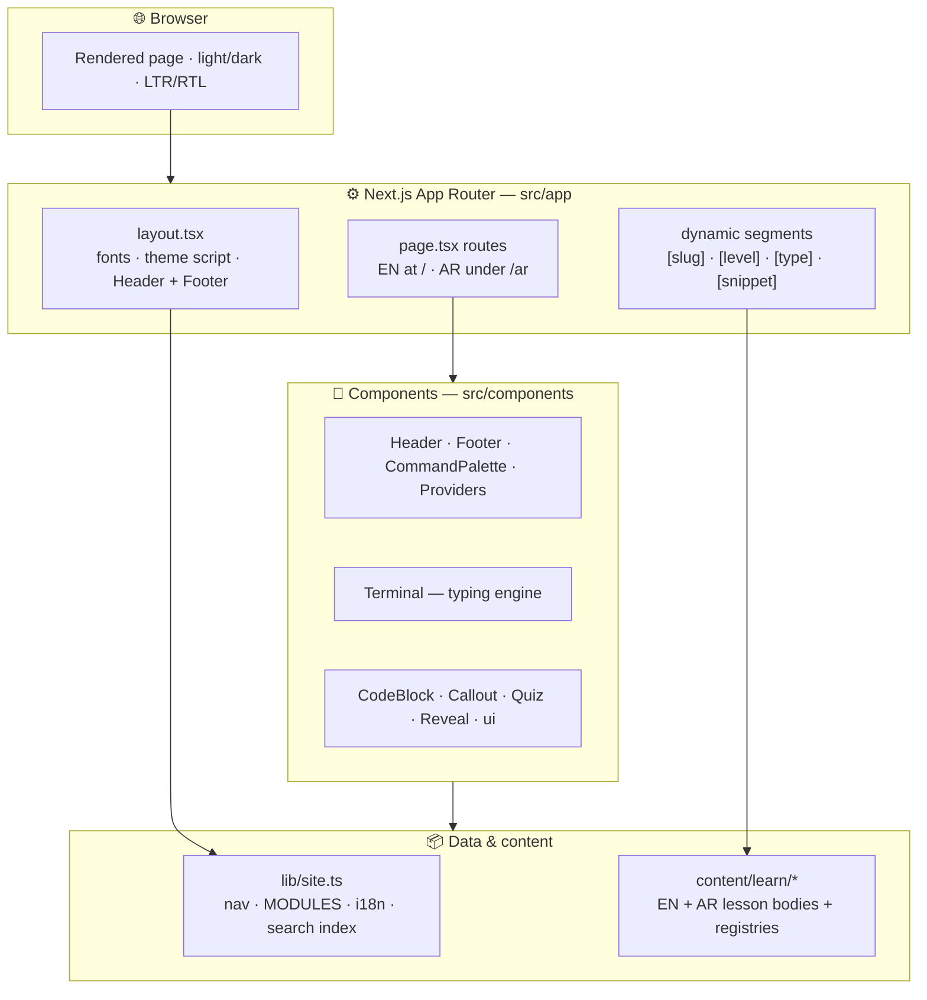
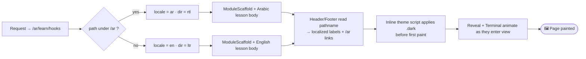
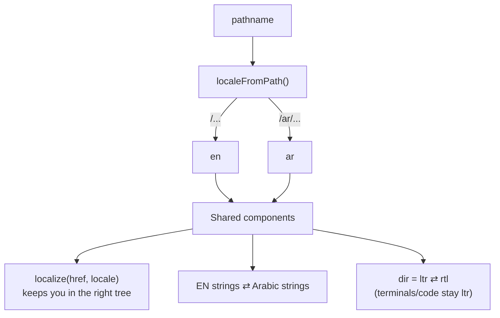
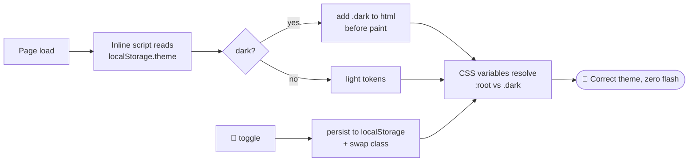
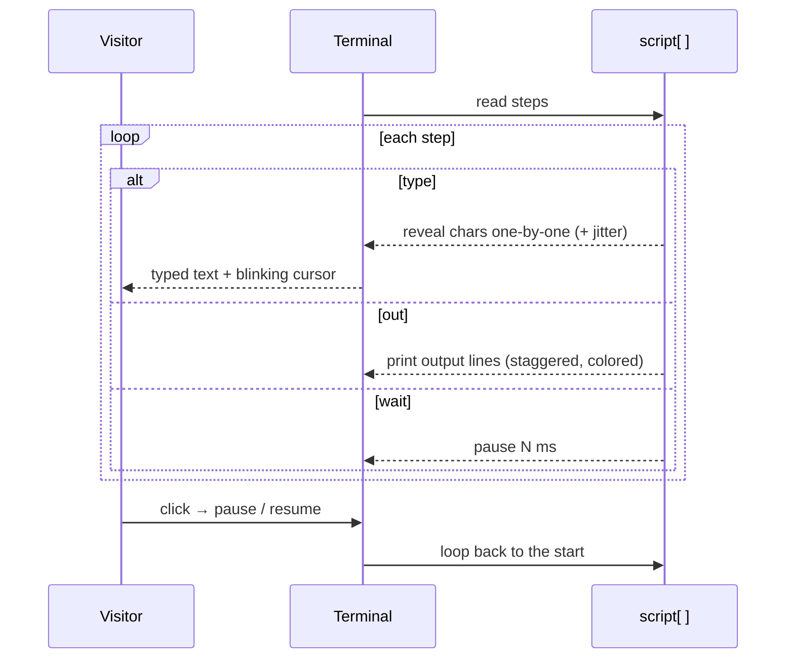
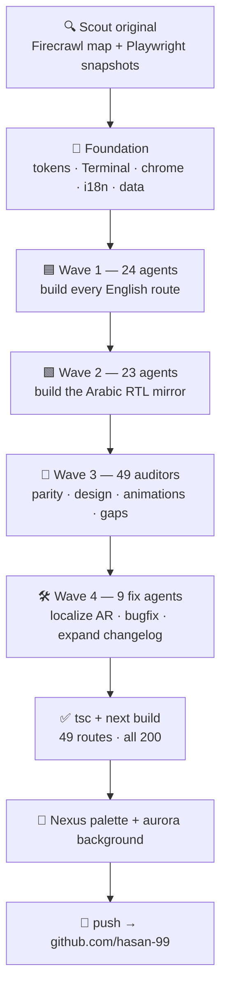

<div align="center">

# ⬡ claude.hjahouse.me

### An interactive, **bilingual** learning platform for Claude Code

A faithful, pixel-aware rebuild of an interactive Claude Code learning site — **English + العربية (full RTL)**, light **and** dark, with animated terminals, an interactive playground, a config builder, quizzes, and 12 hands‑on modules. Branded with the **Nexus‑AI** identity.

`Next.js 16` · `React 19` · `TypeScript` · `Tailwind v4` · `49 routes` · `EN + AR` · `light + dark`

</div>

---

## 📑 Table of contents

1. [What is this repo for?](#-what-is-this-repo-for)
2. [Feature highlights](#-feature-highlights)
3. [Site map](#-site-map)
4. [Architecture at a glance](#-architecture-at-a-glance)
5. [How a request becomes a page](#-how-a-request-becomes-a-page)
6. [Bilingual (i18n) routing](#-bilingual-i18n-routing)
7. [Theme: no‑flash dark mode](#-theme-no-flash-dark-mode)
8. [The animated terminal engine](#-the-animated-terminal-engine)
9. [Design system & brand](#-design-system--brand)
10. [Project structure](#-project-structure)
11. [Routes](#-routes)
12. [Run locally](#-run-locally)
13. [How it was built](#-how-it-was-built)

---

## 🎯 What is this repo for?

This repo is a **complete, self‑contained web app** that teaches people how to use **Claude Code** (Anthropic's terminal coding agent) — *by doing, not reading*. Instead of static docs, every concept is interactive:

- **Try** commands in a real in‑browser terminal (no install, no API key)
- **Generate** real config files (`CLAUDE.md`, hooks, skills, MCP servers, plugins) with live preview
- **Verify** understanding with quizzes at the end of every module

It's fully **bilingual** — every page exists in English (`/`) and Arabic with right‑to‑left layout (`/ar`) — and ships in both **light and dark** themes.



---

## ✨ Feature highlights

| Area | What it does |
|---|---|
| 🖥️ **Animated terminal** | Character‑by‑character typing engine with blinking cursor, click‑to‑pause, looped scripts. Powers the hero demo + module demos. |
| 💻 **Playground** | A real interactive terminal sandbox — type slash‑commands (`/help`, `/clear`, `/model`…) and natural‑language prompts, get simulated Claude responses, command history. |
| 🛠️ **Config Builder** | Tabbed forms (CLAUDE.md · Skill · Agent · Hook · MCP · Plugin) that **generate config live** with copy/download. |
| 🔎 **Feature Index** | ~259 Claude Code features, searchable + filterable by **type / level / category**. |
| 🎯 **Quiz** | Self‑assessment that routes you to a Beginner / Intermediate / Advanced result with recommended modules. |
| 📚 **12 modules** | Full lessons with prose, code blocks, terminal demos and a quiz — in **EN + AR**. |
| 📋 **Cheat Sheet** | Printable reference of commands, shortcuts, files, CLI flags. |
| 🗓️ **Changelog** | All **63** versions with detail. |
| ⌨️ **Command palette** | `Ctrl/⌘ + K` fuzzy search across pages & modules. |
| 🌗 **Theme + 🌍 i18n** | No‑flash dark mode; locale‑aware chrome; RTL for Arabic. |
| 🎞️ **Motion** | Scroll‑reveal on every section + hover micro‑interactions. |

---

## 🗺️ Site map



---

## 🏗️ Architecture at a glance

A clean, layered structure — pages wire things together, components hold behaviour, `lib` + `content` hold data. Vendors are reached through thin seams.



---

## 🔁 How a request becomes a page



---

## 🌍 Bilingual (i18n) routing

English lives at the root; Arabic is a parallel subtree under `/ar` that **reuses the same components** with a `locale` prop. The chrome (Header/Footer/scaffold) derives the locale from the URL, swaps copy, prefixes internal links with `/ar`, and flips direction to RTL — while terminals and code blocks stay LTR.



---

## 🌗 Theme: no‑flash dark mode

A tiny **inline script** runs before the first paint, so there's never a white flash when loading a dark page. All colors are CSS variables that flip between `:root` and `.dark`.



---

## ⌨️ The animated terminal engine

`Terminal.tsx` is a small state machine that walks a **script** of steps and renders them with realistic timing. The same component drives the hero, module demos, and (interactively) the Playground.



Each step is one of: `type` (typed input) · `out` (printed output lines) · `print` (instant line) · `wait` · `clear`. Tones map to terminal colors (`green`, `amber`, `blue`, `purple`, `error`…).

---

## 🎨 Design system & brand

Token‑driven (Tailwind v4 `@theme` + CSS variables), so light/dark and rebrands are one‑file changes. Identity comes from **Nexus‑AI**.

| Token | Light | Dark | Use |
|---|---|---|---|
| `--accent` | `#19ACE7` | `#2BB6EE` | brand cyan — CTAs, links, focus |
| `--fg` | `#1B2433` | `#F3F7FB` | headings / primary text |
| `--bg` | `#F6F9FC` | `#0E1622` | page ground |
| `--card` | `#FFFFFF` | `#16202E` | surfaces |
| levels | green · cyan · rose | — | beginner / intermediate / advanced |

Plus a fixed **multi‑hue aurora** background (cyan · violet · teal · pink) — subtle in light, vivid over navy in dark. Fonts: **DM Sans** (body), **Source Serif 4** (headings), **JetBrains Mono** (code).

---

## 📂 Project structure

```text
src/
├─ app/                       # Next.js App Router
│  ├─ layout.tsx              # fonts · metadata · theme script · Header/Footer
│  ├─ page.tsx                # 🏠 EN home (animated hero)
│  ├─ globals.css             # design tokens (light/dark) · animations · aurora bg
│  ├─ learn/[slug]/           # 12 EN modules (dynamic)
│  ├─ playground/             # interactive terminal + PlaygroundClient
│  ├─ build/                  # Config Builder + BuilderClient
│  ├─ catalog/ quiz/ reference/ resources/ changelog/ feedback/ roadmap/ …
│  └─ ar/                     # 🌍 full Arabic (RTL) mirror of every route
├─ components/                # Header · Footer · Terminal · CommandPalette
│  ├─ Providers.tsx           #   theme + Ctrl/⌘K palette context
│  ├─ ModuleScaffold.tsx      #   module chrome (sidebar · prev/next · locale)
│  ├─ CodeBlock.tsx content.tsx ui.tsx Reveal.tsx
├─ content/learn/             # per‑module lesson bodies
│  ├─ *.tsx                   #   English lessons + registry.tsx
│  └─ ar/*.tsx                #   Arabic lessons + registry-ar.tsx
└─ lib/site.ts                # nav · MODULES · i18n strings · search index
```

---

## 🧭 Routes

| Area | English | Arabic (RTL) |
|---|---|---|
| Home | `/` | `/ar` |
| Learn (12 modules) | `/learn`, `/learn/[slug]` | `/ar/learn`, `/ar/learn/[slug]` |
| Playground | `/playground` | `/ar/playground` |
| Config Builder | `/build` | `/ar/build` |
| Feature Index | `/catalog` | `/ar/catalog` |
| Quiz + results | `/quiz`, `/quiz/result/[level]` | `/ar/quiz`, `/ar/quiz/result/[level]` |
| Cheat Sheet | `/reference` | `/ar/reference` |
| Resources / Changelog / Feedback / Roadmap | `/resources` `/changelog` `/feedback` `/roadmap` | `/ar/…` |
| Certificate / Shared snippet | `/certificate/[type]`, `/share/snippet/[slug]` | — |

---

## ▶️ Run locally

```bash
npm install
npm run dev      # http://localhost:3000  (uses 3001 if 3000 is busy)
```

```bash
npm run build && npm start    # production build + serve
```

**Optional — use the real hostname locally.** Add to `C:\Windows\System32\drivers\etc\hosts` (admin) then visit `http://claude.hjahouse.me:3000`:

```text
127.0.0.1   claude.hjahouse.me
```

---

## 🤖 How it was built

The whole site was produced with **parallel AI agent workflows** — scout the original, lay a shared foundation, then fan out one agent per route, audit everything against the source, and fix in parallel.



---

<div align="center">

**Built by Hasan Jahoush · حسن الجاهوش**

⬡ claude.hjahouse.me

</div>
